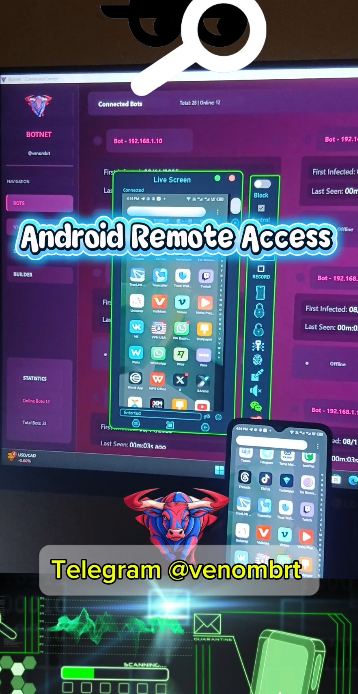

# Android-
Crypters Fud undetectable ethical hacking 
# 📚 Android 威胁 — 教育性概述

> **免责声明：** 本仓库仅用于**教育与防御意识**。  
> 不包含恶意软件、漏洞利用或操作性指南。  
> 目标是让用户、开发者与安全防御人员了解存在的威胁并加强防护。

---

## 🚨 存在的威胁
针对 Android 的恶意软件有多种形式：  
- **间谍软件（Spyware）** — 隐秘收集数据（消息、通话、位置信息）。  
- **远程访问木马（RATs）** — 允许远程控制设备。  
- **勒索软件（Ransomware）** — 锁定或加密文件以勒索赎金。  
- **VNC / HVNC 滥用** — 远程控制工具被恶意利用。  
- **加壳/加密器（Crypters & Packers）** — 用于隐藏恶意软件以规避检测的技术。

---

## 🧰 技术（仅概念性）
- **零日（Zero-day）** — 尚未公开或修补的漏洞，在补丁发布前被利用。  
- **零点击攻击（Zero-click）** — 无需用户交互即可触发的漏洞攻击（例如接收恶意消息）。  
- **混淆与规避** — 攻击者用来伪装或躲避检测的方法。  
- **社会工程学** — 诱导用户安装有害应用或授予权限的欺骗手段。

---

## 🛡 目的
- 提高移动威胁的认知。  
- 鼓励安全开发与安全使用设备的最佳实践。  
- 支持防御性安全研究与合规分析。

---

## 📞 联系
用于教育讨论的 Telegram（请替换为你的频道/群组）:  
👉 [Telegram 频道](https://t.me/poisonbrt)

---

## 🖼 横幅
将非恶意的横幅放在：`./assets/banner.png`（建议尺寸 1280×320 px）。

---

## ⚖️ 许可证
本仓库采用 **MIT 许可证** —— 仅用于合法、防御和教育目的。
